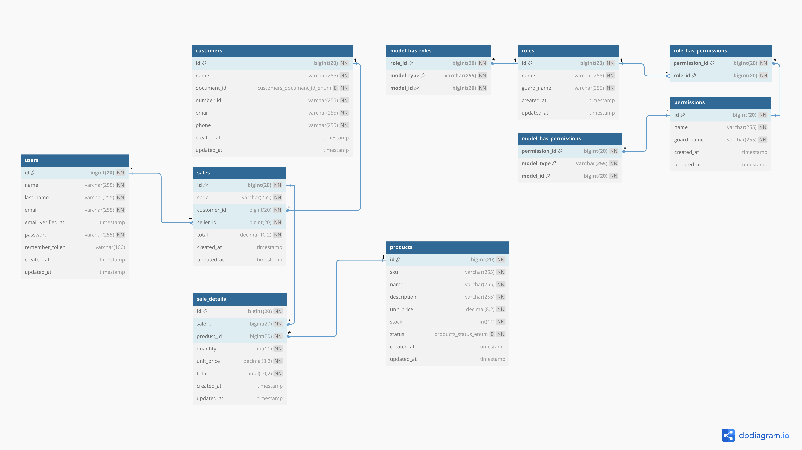

 # Proyecto Backend IDBI

## Tecnologías Utilizadas
- **Laravel v11**
- **Laravel Sanctum v4**
- **Laravel Spatie v6**
- **MySQL**

---

## Instalación y Ejecución

Sigue estos pasos para instalar y ejecutar el proyecto:

1. **Clonar el repositorio:**  
   ```sh
   git clone https://github.com/LR13-stack/backend_idbi.git
   ```

2. **Configurar el archivo de entorno:**  
   Renombrar el archivo `.env.example` a `.env` y establecer las credenciales de conexión a la base de datos.

3. **Generar la clave de la aplicación y limpiar cachés:**  
   ```sh
   php artisan key:generate
   php artisan config:clear
   php artisan cache:clear
   php artisan route:clear
   ```

4. **Ejecutar las migraciones con seeders:**  
   ```sh
   php artisan migrate --seed
   ```

5. **Levantar el servidor:**  
   ```sh
   php artisan serve
   ```

---

## Estructura del Proyecto

```
app/
│-- Exports/
│-- Http/
│   │-- Controllers/
│   │-- Requests/
│   │-- Resources/
│-- Models/
│-- Providers/
│-- Services/
```

---

## Middleware y Autenticación

El proyecto utiliza:
- **Spatie** para la gestión de roles (Administrador y Vendedor).
- **Sanctum** para la autenticación mediante tokens Bearer.

### Rutas Principales

#### **Autenticación**
```php
Route::post('/login', [AuthController::class, 'login']);
Route::post('/register', [AuthController::class, 'register']);
Route::post('/logout', [AuthController::class, 'logout'])->middleware('auth:sanctum');
```

#### **Gestión de Usuarios (Solo Administrador)**
```php
Route::middleware(['auth:sanctum', 'role:Administrador'])->group(function () {
    Route::get('/users', [UserController::class, 'index']);
    Route::post('/users', [UserController::class, 'store']);
    Route::get('/users/{user}', [UserController::class, 'show']);
    Route::put('/users/{user}', [UserController::class, 'update']);
    Route::delete('/users/{user}', [UserController::class, 'destroy']);
});
```

#### **Gestión de Productos, Ventas y Clientes (Administrador y Vendedor)**
```php
Route::middleware(['auth:sanctum', 'role:Administrador|Vendedor'])->group(function () {
    Route::get('/products', [ProductController::class, 'index']);
    Route::post('/products', [ProductController::class, 'store']);
    Route::get('/products/{product}', [ProductController::class, 'show']);
    Route::put('/products/{product}', [ProductController::class, 'update']);

    Route::get('/sales', [SaleController::class, 'index']);
    Route::post('/sales', [SaleController::class, 'store']);
    Route::get('/sales/{sale}', [SaleController::class, 'show']);

    Route::get('/customers', [CustomerController::class, 'index']);
    Route::post('/customers', [CustomerController::class, 'store']);
    Route::get('/customers/{customer}', [CustomerController::class, 'show']);
    Route::put('/customers/{customer}', [CustomerController::class, 'update']);
});
```

---

## Uso de los Endpoints (Postman o similar)

### **Inicio de Sesión**
**Ruta:** `POST http://127.0.0.1:8000/api/login`

**Ejemplo de solicitud:**
```json
{
  "email": "admin@test.com",
  "password": "password"
}
```

**Ejemplo de respuesta:**
```json
{
  "message": "Inicio de sesión exitoso.",
  "data": {
    "id": 1,
    "name": "Admin",
    "last_name": "Admin",
    "email": "admin@test.com",
    "created_at": "01-02-2025 23:55:06"
  },
  "access_token": "4|HNJfeAfus5qZa3SUFN0PWOnQQmzGN6CJAFQidfH3d5f8c0cc",
  "token_type": "Bearer"
}
```

> **Nota:** Se debe copiar el `access_token` y configurarlo como autenticación Bearer en Postman para acceder a rutas protegidas.

---

## **Generación de Reportes**

### **Reporte de Productos Más Vendidos**
**Ruta:** `POST /api/reports/best-selling-products`

**Ejemplo de solicitud:**
```json
{
  "start_date": "2025-01-01",
  "end_date": "2025-02-02",
  "product_name": "",
  "customer_name": "",
  "seller_name": "Vendedor",
  "format": "json"
}
```

**Ejemplo de respuesta:**
```json
[
  {
    "sku": "P002",
    "name": "Tablet",
    "total_quantity": "11",
    "total_sales": "10890.00"
  },
  {
    "sku": "P001",
    "name": "Laptop Gamer aaaaa",
    "total_quantity": "3",
    "total_sales": "9000.00"
  }
]
```

---

### **Reporte de Ventas Diarias, Semanales y Mensuales**
**Ruta:** `POST /api/reports/sales`

**Ejemplo de solicitud:**
```json
{
  "start_date": "2025-02-02",
  "end_date": "2025-02-02",
  "customer_id": null,
  "seller_id": 2,
  "format": "json"
}
```

**Ejemplo de respuesta:**
```json
[
  {
    "code": "V002",
    "customer_name": "John Doe",
    "customer_identification": "DNI 12345678",
    "customer_email": "johnDoe@test.com",
    "total_products": "12",
    "total_sales": "15900.00",
    "sale_date": "02/02/2025 00:03:34"
  },
  {
    "code": "V001",
    "customer_name": "John Doe",
    "customer_identification": "DNI 12345678",
    "customer_email": "johnDoe@test.com",
    "total_products": "2",
    "total_sales": "3990.00",
    "sale_date": "02/02/2025 00:01:05"
  }
]
```

---

### **Diagrama ERD**



---
